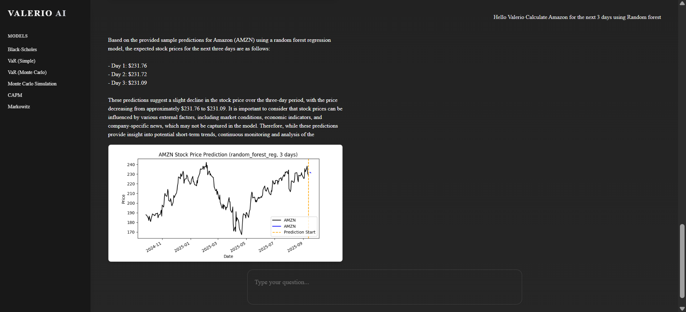

#  Valerio AI – Financial Intelligence System

## 1. Introduction

Valerio AI is a **hybrid financial intelligence system** that integrates **machine learning models** with **classical financial models**.  
It supports **real-time stock predictions** and **quantitative risk analysis**, providing results in both **English** and **Spanish**.

---

##  2. Objectives

- Predict short-term stock prices using trained ML models.  
- Provide professional analysis with classical models (Black-Scholes, CAPM, Markowitz, Monte Carlo, VaR).  
- Deliver explanations and results in **natural language**.  
- Support bilingual interaction (**English & Spanish**).  
- Display interactive results with **graphs** and a **web-based interface**.

---

##  3. Features

- **Machine Learning Models**: XGBoost, Random Forest, Linear Regression, SVR.  
- **Financial Models**: Black-Scholes, CAPM, Markowitz Optimization, Monte Carlo Simulations, Value-at-Risk.  
- **Real-Time Data**: Integration with [Yahoo Finance](https://pypi.org/project/yfinance/).  
- **NLU Module**: Intent classification for user queries.  
- **Multilingual**: Questions in English or Spanish.  
- **Frontend Interface**: Built with **React + TailwindCSS**, connected to FastAPI backend.  

---

##  4. System Architecture

```text
User → React Frontend → FastAPI Backend → ML Models & Financial Tools → Response + Graph

- Backend: FastAPI (Python)
- Frontend: React (Vite, TailwindCSS)
- ML Training: scikit-learn, XGBoost
- Graphs: Matplotlib, base64 integration
- Deployment: Localhost / API ready

```
##  5. Dataset & Training

- Dataset: `apple_data.csv` (closing prices, volume, returns).
- Features engineered: `Return`, `MA5`, `MA10`, `Volatility5`, `Volume_Ratio`.
- Target: next-day price (`Close` shifted).
- Train/Test split: 80/20, chronological.
- Saved models: `.pkl` files for XGBoost, Random Forest, Linear Regression, SVR.

---

##  6. Models Included

### Machine Learning
- **XGBoost** – non-linear boosting, robust to volatility.
- **Random Forest** – ensemble regression with interpretability.
- **Linear Regression** – baseline comparison.
- **SVR (Support Vector Regression)** – kernel-based, captures complex trends.

### Financial
- **Black-Scholes** – option pricing model (call/put).
- **CAPM** – risk/return relationship with market beta.
- **Markowitz Portfolio Optimization** – efficient frontier & optimal weights.
- **Monte Carlo Simulations** – stochastic modeling of asset prices.
- **Value-at-Risk (VaR)** – both parametric and Monte Carlo approaches.

---

## 7. Examples of Use

Here are some real interactions with **Valerio AI**:

- **XGBoost Prediction (Tesla, 7 days – English)**  
*Query*: "Hello Valerio, calculate Tesla price for the next 7 days using XGBoost"  


- **XGBoost Prediction (Tesla, 5 days – Spanish)**  
*Consulta*: "Hola Valerio, calcula el precio de Tesla para los próximos 5 días usando XGBoost"  


- **Random Forest Prediction (Amazon, 3 days – English)**  
*Query*: "Predict Amazon stock for the next 3 days using Random Forest"  


- **Monte Carlo Simulation**  
*Query*: "Simulate Monte Carlo for asset price S0=100 mu=0.05 sigma=0.2 T=1 year"  


- **Markowitz Portfolio Optimization**  
*Query*: "Run a Markowitz optimization with 3 assets"  


---

## 8. Installation & Setup

Follow these steps to run **Valerio AI** locally:

1. **Clone the repository**  
```bash
git clone https://github.com/Johanc-x/valerio-ai.git
cd valerio-ai

2. **Backend setup (FastAPI)**
# Create virtual environment
python -m venv .venv
source .venv/bin/activate   # Linux/Mac
.venv\Scripts\activate      # Windows PowerShell

# Install dependencies
pip install -r requirements.txt

# Run FastAPI backend
uvicorn app.main:app --reload

3. **Frontend setup (React + Vite + TailwindCSS)**
cd valerio-ui
npm install
npm run dev

4. **Access Valerio AI**
- Open your browser at: http://127.0.0.1:8000 for the backend API.
- Open your browser at: http://localhost:5173 for the frontend interface.
```
---

## 9.  Results

Valerio AI successfully integrates **machine learning** and **financial models** into a unified intelligent system.  

- **ML Models** deliver accurate short-term stock price forecasts.  
   - XGBoost: best overall performance and robustness.  
   - Random Forest: competitive with higher interpretability.  
   - Linear Regression: used as baseline comparison.  
   - SVR: capable of capturing non-linear dynamics.  

- **Financial Models** provide clear risk/return insights with visual outputs.  
   - Black-Scholes: option pricing for calls and puts.  
   - CAPM: relation of systematic risk and expected return.  
   - Markowitz: efficient frontier and portfolio optimization.  
   - Monte Carlo: stochastic simulation of price paths.  
   - Value-at-Risk (VaR): both parametric and Monte Carlo approaches.  

🔹 Results are presented in **graphs, explanations, and bilingual responses (EN/ES)**, ensuring both **technical accuracy** and **usability** for recruiters, analysts, and decision-makers.

---

## 10.  Conclusions

Valerio AI demonstrates how **machine learning techniques** and **classical financial models** can be integrated into a single intelligent assistant capable of:  
- Delivering **real-time predictions** for financial assets.  
- Providing **risk management insights** with clear explanations.  
- Supporting **multilingual interaction** (English & Spanish).  
- Combining **visual outputs** with professional analysis to enhance decision-making.  

This system not only works as a technical demonstration but also as a **professional showcase** of analytical, programming, and financial modeling skills.  
It reflects a solid combination of **Economics, Finance, and Software Development (DAM)** applied to real-world financial problems.  

Valerio AI is designed to be scalable — ready to incorporate new datasets, extend to deep learning architectures, and deploy on cloud platforms.  

🔹 Recruiters, professionals, and collaborators can see Valerio AI in action through the **GitHub repository, live demos, and reels**, confirming that this project goes beyond scripts: it is an **operational AI system**.

---

## 11.  Technologies Summary  

| Tool / Language  | Usage |
|------------------|---------------------------------------------|
| **Python**       | Data processing, ML training, financial models |
| **scikit-learn** | XGBoost, Random Forest, SVR, Linear Regression |
| **NumPy / Pandas** | Data manipulation, returns, volatility, indicators |
| **Matplotlib**   | Graphs (time series, Monte Carlo, Markowitz) |
| **FastAPI**      | REST API backend, JSON endpoints |
| **React + Vite** | Web-based frontend interface |
| **TailwindCSS**  | Frontend styling |
| **VS Code**      | Main development environment |

---

## 12.  Project Structure  

```
valerio-ai/
├── api/ # FastAPI endpoints
├── demo/ # Example responses & tests
├── valerio-ui/ # React + TailwindCSS frontend
├── img/ # Visual outputs (XGBoost, RF, Monte Carlo, Markowitz)
├── requirements.txt # Dependencies
└── README.md # Main documentation
```
---

## Author  

**Jhojan Giovanni Cachay Rios**  
Bachelor in Economics, Master in Finance & Accounting  
DAM Student (Multiplatform Application Development)  

[LinkedIn](https://www.linkedin.com/in/jhojancachay)  


